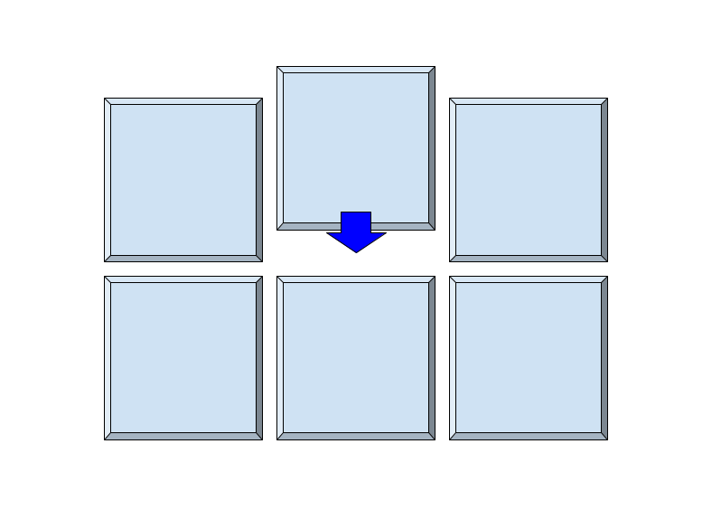

# kerchunk

Cloud-friendly access to archival data

Kerchunk is a library that provides a unified way to represent a variety of chunked, compressed 
data formats (e.g. NetCDF, HDF5, GRIB),
allowing efficient access to the data from traditional file systems or cloud object storage.  
It also provides a flexible way to create
virtual datasets from multiple files.  It does this by extracting the byte ranges, 
compression information and other information about the
data and storing this metadata in a new, separate object.  This means that you can
create a virtual aggregate dataset over potentially many source
files, for efficient, parallel and cloud-friendly *in-situ* access without having to copy or
translate the originals. It is a gateway to in-the-cloud massive data processing while
the data providers still insist on using legacy formats for archival storage.

For further information, please see the documentation pages.
