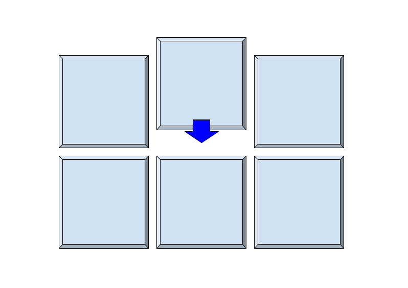

# kerchunk

Cloud-friendly access to archival data

> **Note:** Kerchunk is in maintenance mode. No new features are planned, though bug
> fixes will continue to be accepted. For new projects, we recommend
> [VirtualiZarr](https://virtualizarr.readthedocs.io/) for creating virtual Zarr
> datasets, together with [Icechunk](https://icechunk.io/) as the storage engine.
> See the FAQ for a
> [comparison of libraries](https://virtualizarr.readthedocs.io/en/stable/explanation/faq.html#how-do-the-virtualizarr-and-kerchunk-libraries-compare),
> [comparison of supported storage formats](https://virtualizarr.readthedocs.io/en/stable/explanation/faq.html#which-format-should-i-save-my-virtual-references-as),
> and for how to [migrate existing Kerchunk references](https://virtualizarr.readthedocs.io/en/stable/explanation/faq.html#i-have-already-kerchunked-my-data-do-i-have-to-redo-that).

Kerchunk is a library that provides a unified way to represent a variety of chunked, compressed
data formats (e.g. NetCDF, HDF5, GRIB),
allowing efficient access to the data from traditional file systems or cloud object storage.
It also provides a flexible way to create
virtual datasets from multiple files.  It does this by extracting the byte ranges,
compression information and other information about the
data and storing this metadata in a new, separate object.  This means that you can
create a virtual aggregate dataset over potentially many source
files, for efficient, parallel and cloud-friendly *in-situ* access without having to copy or
translate the originals. It is a gateway to in-the-cloud massive data processing while
the data providers still insist on using legacy formats for archival storage.

*Why Kerchunk*:

We provide the following things:

- completely serverless architecture
- metadata consolidation, so you can understand a many-file dataset (metadata plus physical storage) in a single read
- read from all of the storage backends supported by fsspec, including object storage (s3, gcs, abfs, alibaba), http,
  cloud user storage (dropbox, gdrive) and network protocols (ftp, ssh, hdfs, smb...)
- loading of various file types (currently netcdf4/HDF, grib2, tiff, fits, zarr), potentially heterogeneous within a
  single dataset, without a need to go via the specific driver (e.g., no need for h5py)
- asynchronous concurrent fetch of many data chunks in one go, amortizing the cost of latency
- parallel access with a library like zarr without any locks
- logical datasets viewing many (>~millions) data files, and direct access/subselection to them via coordinate
  indexing across an arbitrary number of dimensions

For further information, please see [the documentation](https://fsspec.github.io/kerchunk/).
