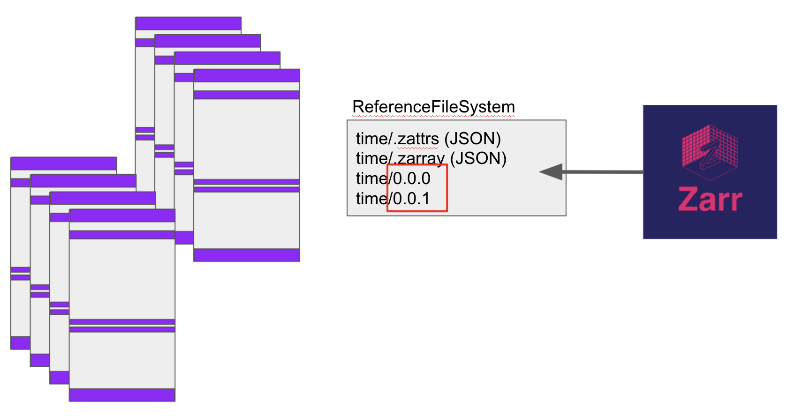

Detailed description
====================

We will demonstrate how this library can lead to parallel, cloud-friendly access of data with
specific reference to netCDF4/HDF5 files, which were the motivating first case we attempted.
HDF5 is one of the data formats that already readily supports direct reading from cloud storage,
whether over HTTP or by passing ``fsspec`` instances. Nevertheless, the ability to extract
metadata in a single scan, and to arrange multiple chunks from multiple files and
read them in parallel and/or concurrently within a single indexible aggregate dataset -
*that* is the power of this project.

.. note::

   "Parallel" means actions taking place in multiple threads, processes or machines, each
   completely independent of the others. After overheard for arranging such a system are
   taken into account, a speedup equal to the number of CPU cores leveraged is possible,
   for CPU-intensive workloads.

   "Concurrency", by contrast, refers to mutiple operations that are *waiting* on an external
   system. For the particular case of cloud storage, the latency to get the first byte of a read
   can be comparable or dominate the total time for a request. So if you can launch many
   requests, and only pay the overhead cost once (they all wait together), then a large speedup
   is possible.

   ``kerchunk`` with ``dask`` and ``zarr`` allows us to make use of both these techniques
   simultaneously.

Binary buffers
--------------

Numerical arrays in python (and all other modern languages) are stored in binary buffers.
For example, if the data type is int32, then 4 bytes are used per value, and an array of
total N elements is stored in a single Nx4 block of bytes. This remains true for multiple
dimensions.

If you want to store such data to disk, you cannot be more efficient than to take the buffer
representation, perhaps pass it through some codecs (e.g., compression) and write those bytes
directly. HDF5 does this, and so do almost all other binary formats. An HDF5 is made up of
binary chunks and metadata areas, describing the types and sizes of the binary chunks, how
they relate to one-another and any other metadata/attributes that might be associated.

.. image:: images/binary_buffer.png
  :width: 400
  :alt: HDF5 files contain C buffers

``fsspec`` virtual filesystem
-----------------------------

``fsspec`` was designed allow access to any storage backend and present it using the same filesystem-like
interface, so that other libraries could ingest data from anywhere. The idea was originally
motivated by the need for ``dask`` to be able to read data from cloud storage in parallel on a
distributed cluster.

Given this framework, we have created ``ReferenceFileSystem``, which allows arbitrary mapping of
a pathname to:

  - a static binary value
  - a whole file at a different URL
  - part of a file at a different URL

Thus, for each of the binary chunks in one (or more) HDF file, we can assign is a position within a
directory tree as we see fit.

``zarr`` reader
---------------

The zarr array storage library reads data by first reading two small special JSON files, ``.zarray`` and
``.zattrs`` in a given directory, which give information about the array shape, chunking, encoding and
attributes. The chunks of data themselves are expected to live at paths like ``"var/x.y"``, where
``var`` is the name of the variable and ``x, y`` are chunk indexes in two dimensions (there can be more!).

In the example image, we demonstrate how zarr can access data across the chunks of many HDF5 files, if
we construct a virtual filesystem in which each binary chunk is given the exact correct filename as
expected by ``zarr``, in this case for the variable "time".

.. raw:: html

    
