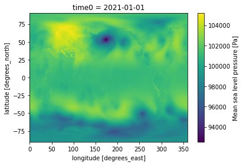
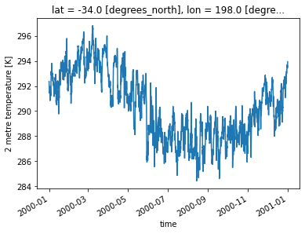

Tutorial
========

This run-through tutorial is intended to display a variety of methods for combining datasets using the ``kerchunk.combine.MultiZarrtoZarr`` API.

Initially we create a pair of single file jsons for two ERA5 variables using ``Kerchunk.hdf.SingleHdf5ToZarr``. This ERA5 dataset is free to access and so it is possible to replicate this workflow on a local machine without credentials.

Single file JSONs
-----------------

The ``Kerchunk.hdf.SingleHdf5ToZarr`` method is used to create a single ``.json`` reference file for each file url passed to it. Here we use it to create a number of reference files for the ERA5 public dataset on `AWS <https://registry.opendata.aws/ecmwf-era5/>`__. We will compute a number of different times and variables to demonstrate different methods of combining them.

The Kerchunk package is still in a development phase and so changes frequently. Installing directly from the source code is recommended.

.. code::

    !pip install git+https://github.com/fsspec/kerchunk

Here we are considering Netcdf4 files and so use the kerchunk ``hdf`` module. Support for ``fits``, ``grib2``, ``tiff``, ``netCDF3`` and ``zarr`` are available in other kerchunk modules. Alternatively it is also possible to manually create reference jsons for more specific cases. The Earth Big Data `example <https://github.com/fsspec/kerchunk/blob/main/examples/earthbigdata.ipynb>`__ provides a demonstration of this.

.. code::

    from kerchunk.hdf import SingleHdf5ToZarr
    import fsspec

Using fsspec to create a pythonic filesystem, provides a convenient way to manage file urls.

The ``SingleHdf5ToZarr`` method takes both an ``h5f`` file and a ``url`` as input. The ``h5f`` file can either be a binary Python file-like object or a url, in which case it will be opened using ``fsspec`` and ``storage_options``. The ``url`` input is not used to open the file and is intended to allow the user to compute the reference files on data before it is uploaded to its final storage location. Thus the ``url`` input should be the url of the final file destination and not the current location.

.. code::

    fs = fsspec.filesystem('s3', anon=True) #S3 file system to manage ERA5 files
    flist = (fs.glob('s3://era5-pds/2020/*/data/air_pressure_at_mean_sea_level.nc')[:2]
            + fs.glob('s3://era5-pds/2020/*/data/*sea_surface_temperature.nc')[:2])

    fs2 = fsspec.filesystem('')  #local file system to save final jsons to

    from pathlib import Path
    import os
    import ujson

    so = dict(mode='rb', anon=True, default_fill_cache=False, default_cache_type='first') # args to fs.open()
    # default_fill_cache=False avoids caching data in between file chunks to lowers memory usage.

    def gen_json(file_url):
        with fs.open(file_url, **so) as infile:
            h5chunks = SingleHdf5ToZarr(infile, file_url, inline_threshold=300)
            # inline threshold adjusts the Size below which binary blocks are included directly in the output
            # a higher inline threshold can result in a larger json file but faster loading time
            variable = file_url.split('/')[-1].split('.')[0]
            month = file_url.split('/')[2]
            outf = f'{month}_{variable}.json' #file name to save json to
            with fs2.open(outf, 'wb') as f:
                f.write(ujson.dumps(h5chunks.translate()).encode());

ERA5-pds is located in us-west-2 and so depending on where this computation is taking place the time taken can vary dramatically.

.. code::

    %%time
    for file in flist:
        gen_json(file)

.. parsed-literal::

    CPU times: user 30.4 s, sys: 4.74 s, total: 35.1 s
    Wall time: 14min 44s

The ``.json`` reference files we have generated can now be used to open virtual datasets through xarray or zarr. It is necessary to specify location of the reference ``json`` files, using the ``target_options`` argument, and the source data using the ``remote_options`` and ``remote_protocol`` arguments. Here specifying that the source data is stored on ``AWS S3`` and can be accessed anonymously.

.. code::

    import xarray as xr

    %%time
    ds = xr.open_dataset("reference://", engine="zarr", backend_kwargs={
                        "consolidated": False,
                        "storage_options": {"fo": '01_air_pressure_at_mean_sea_level.json', "remote_protocol": "s3","remote_options": {"anon": True}}
                        })
    print(ds)

.. parsed-literal::

    <xarray.Dataset>
    Dimensions:                         (time0: 744, lat: 721, lon: 1440)
    Coordinates:
      * lat                             (lat) float32 90.0 89.75 ... -89.75 -90.0
      * lon                             (lon) float32 nan 0.25 0.5 ... 359.5 359.8
      * time0                           (time0) datetime64[ns] 2020-01-01 ... 202...
    Data variables:
        air_pressure_at_mean_sea_level  (time0, lat, lon) float32 dask.array<chunksize=(24, 100, 100), meta=np.ndarray>
    Attributes:
        institution:  ECMWF
        source:       Reanalysis
        title:        ERA5 forecasts
    CPU times: user 162 ms, sys: 17.4 ms, total: 180 ms
    Wall time: 235 ms

Combine multiple kerchunked datasets into a single logical aggregate dataset
----------------------------------------------------------------------------

The ``Kerchunk.combine.MultiZarrtoZarr`` method combines the ``.json`` reference files generated above to create a single virtual dataset, such that one reference file maps to all of the chunks in the individual files.

.. code::

    from kerchunk.combine import MultiZarrToZarr

MultiZarrtoZarr provides a number of convenience methods to combine reference files. The simplest is to concatenate along a specified dimension using the ``concat_dims`` argument, ``"Time0"`` in this instance. Variables that should not be concatenated (because they are not a function of the concat coordinates) should be listed in the ``identical_dims`` argument.

.. code::

    json_list = fs2.glob("*_air_pressure_at_mean_sea_level.json")

    mzz = MultiZarrToZarr(json_list,
        remote_protocol='s3',
        remote_options={'anon':True},
        concat_dims=['time0'],
        identical_dims = ['lat', 'lon'])

    d = mzz.translate()

    with fs2.open('air_pressure_at_mean_sea_level_combined.json', 'wb') as f:
        f.write(ujson.dumps(d).encode())

The reference json we have just generated can now be opened to reveal a single virtual dataset spanning both the input files, with little to no latency.

.. code::

    %%time
    backend_args = {"consolidated": False, "storage_options": {"fo": d, "remote_protocol": "s3","remote_options": {"anon": True}}}
    print(xr.open_dataset("reference://", engine="zarr", backend_kwargs=backend_args))

.. parsed-literal::

    <xarray.Dataset>
    Dimensions:                         (time0: 1440, lat: 721, lon: 1440)
    Coordinates:
      * lat                             (lat) float32 90.0 89.75 ... -89.75 -90.0
      * lon                             (lon) float32 nan 0.25 0.5 ... 359.5 359.8
      * time0                           (time0) datetime64[ns] 2020-01-01 ... 202...
    Data variables:
        air_pressure_at_mean_sea_level  (time0, lat, lon) float32 ...
    Attributes:
        institution:  ECMWF
        source:       Reanalysis
        title:        ERA5 forecasts
    CPU times: user 42.3 ms, sys: 128 µs, total: 42.5 ms
    Wall time: 40.9 ms

Using coo_map
~~~~~~~~~~~~~

When the dimension along which we would like to concatenate is not already in the dataset, or when considering datasets from across an ensemble we can use the ``coo_map`` argument to create a new dimension.

.. code::

    new_dims = ['a' , 'b']

    mzz = MultiZarrToZarr(json_list,
        remote_protocol='s3',
        remote_options={'anon':True},
        coo_map = {'new_dimension':new_dims},
        concat_dims=['new_dimension'],
        identical_dims = ['lat', 'lon']
    )

    d = mzz.translate()

    backend_args = {"consolidated": False, "storage_options": {"fo": d, "remote_protocol": "s3","remote_options": {"anon": True}}}
    print(xr.open_dataset("reference://", engine="zarr", backend_kwargs=backend_args))

.. parsed-literal::

    <xarray.Dataset>
    Dimensions:                         (new_dimension: 2, time0: 744, lat: 721,
                                         lon: 1440)
    Coordinates:
      * lat                             (lat) float32 90.0 89.75 ... -89.75 -90.0
      * lon                             (lon) float32 nan 0.25 0.5 ... 359.5 359.8
      * new_dimension                   (new_dimension) object 'a' 'b'
      * time0                           (time0) datetime64[ns] 2020-01-01 ... 202...
    Data variables:
        air_pressure_at_mean_sea_level  (new_dimension, time0, lat, lon) float32 ...
    Attributes:
        institution:  ECMWF
        source:       Reanalysis
        title:        ERA5 forecasts

Here by providing a list of literal values to ``coo_map`` we created ``new_dimension``.

For more complex uses it is also possible to pass in a compiled ``regex`` function which operates on the input file urls to generate a unique variable for each file.

.. code::

    import re
    ex = re.compile(r'.*(\d+)_air')
    print(ex.match(json_list[0]).groups()[0])

.. parsed-literal::

    '1'

.. code::

    mzz = MultiZarrToZarr(json_list,
        remote_protocol='s3',
        remote_options={'anon':True},
        coo_map = {'new_dimension':ex},
        concat_dims=['new_dimension'],
        identical_dims = ['lat', 'lon']
    )

    d = mzz.translate()

    backend_args = {"consolidated": False, "storage_options": {"fo": d, "remote_protocol": "s3","remote_options": {"anon": True}}}
    print(xr.open_dataset("reference://", engine="zarr", backend_kwargs=backend_args))

.. parsed-literal::

    <xarray.Dataset>
    Dimensions:                         (new_dimension: 2, time0: 744, lat: 721,
                                         lon: 1440)
    Coordinates:
      * lat                             (lat) float32 90.0 89.75 ... -89.75 -90.0
      * lon                             (lon) float32 nan 0.25 0.5 ... 359.5 359.8
      * new_dimension                   (new_dimension) object '1' '2'
      * time0                           (time0) datetime64[ns] 2020-01-01 ... 202...
    Data variables:
        air_pressure_at_mean_sea_level  (new_dimension, time0, lat, lon) float32 ...
    Attributes:
        institution:  ECMWF
        source:       Reanalysis
        title:        ERA5 forecasts

Here the ``new_dimension`` values have been populated by the compiled ``regex`` function ``ex`` which takes the file urls as input.

To extract time information from file names, a custom function can be defined of the form ``(index, fs, var, fn) -> value`` to generate a valid ``datetime.datetime`` data type, typically using regular expressions.  These datetime objects are then used to generate time coordinates through the ``coo_dtypes`` argument in the ``MultiZarrToZarr`` function.

Here's an example for file names following the pattern ``cgl_TOC_YYYYmmddHHMM_X21Y05_S3A_v1.1.0.json``:

.. code::

      def fn_to_time(index, fs, var, fn):
          import re
          import datetime
          subst = re.search(r"\d{12}", fn)[0]
          return datetime.datetime.strptime(subst, '%Y%m%d%H%M')

      mzz = MultiZarrToZarr(sorted(glob.iglob(r'*.json')),
          remote_protocol='file',
          coo_map={'time': fn_to_time},
          coo_dtypes={'time': np.dtype('M8[s]')},
          concat_dims=['time'],
          identical_dims=['lat', 'lon'],
      )

.. parsed-literal::

    <xarray.Dataset>
    Dimensions:              (time: 4, lat: 3360, lon: 3360)
    Coordinates:
      * lat                  (lat) float64 35.0 35.0 34.99 ... 25.01 25.01 25.0
      * lon                  (lon) float64 30.0 30.0 30.01 ... 39.99 39.99 40.0
      * time                 (time) datetime64[s] 2022-10-11T07:01:00 ... 2022-10...
    Data variables: (12/53)
        AC_process_flag      (time, lat, lon) float32 dask.array<chunksize=(1, 168, 168), meta=np.ndarray>
        Oa02_toc             (time, lat, lon) float32 dask.array<chunksize=(1, 168, 168), meta=np.ndarray>
        ...                   ...
        VZA_olci             (time, lat, lon) float32 dask.array<chunksize=(1, 168, 168), meta=np.ndarray>
    Attributes: (12/17)
        Conventions:          CF-1.6
        archive_facility:     vito
        copyright:            Copernicus Service information 2022

Similarly we can map each file to a new variable using the special ``var`` key in coo_map. Here we use the same ``regex`` function but instead map these as new variables.

.. code::

    mzz = MultiZarrToZarr(json_list,
        remote_protocol='s3',
        remote_options={'anon':True},
        coo_map = {"var":ex},
        concat_dims=['time0'],
        identical_dims = ['lat', 'lon']
    )

    d = mzz.translate()

    backend_args = {"consolidated": False, "storage_options": {"fo": d, "remote_protocol": "s3","remote_options": {"anon": True}}}
    print(xr.open_dataset("reference://", engine="zarr", backend_kwargs=backend_args))

.. parsed-literal::

    <xarray.Dataset>
    Dimensions:  (time0: 1440, lat: 721, lon: 1440)
    Coordinates:
      * lat      (lat) float32 90.0 89.75 89.5 89.25 ... -89.25 -89.5 -89.75 -90.0
      * lon      (lon) float32 nan 0.25 0.5 0.75 1.0 ... 359.0 359.2 359.5 359.8
      * time0    (time0) datetime64[ns] 2020-01-01 ... 2020-02-29T23:00:00
    Data variables:
        1        (time0, lat, lon) float32 ...
        2        (time0, lat, lon) float32 ...
    Attributes:
        institution:  ECMWF
        source:       Reanalysis
        title:        ERA5 forecasts

Another special key in ``coo_map`` is ``attr:``. This allows the user to access values from each dataset's global attributes.

.. code::

    mzz = MultiZarrToZarr(json_list,
        remote_protocol='s3',
        remote_options={'anon':True},
        coo_map = {"var":"attr:institution"},
        concat_dims=['time0'],
        identical_dims = ['lat', 'lon']
    )

    d = mzz.translate()

    backend_args = {"consolidated": False, "storage_options": {"fo": d, "remote_protocol": "s3","remote_options": {"anon": True}}}
    print(xr.open_dataset("reference://", engine="zarr", backend_kwargs=backend_args))

.. parsed-literal::

    <xarray.Dataset>
    Dimensions:  (time0: 1440, lat: 721, lon: 1440)
    Coordinates:
      * lat      (lat) float32 90.0 89.75 89.5 89.25 ... -89.25 -89.5 -89.75 -90.0
      * lon      (lon) float32 nan 0.25 0.5 0.75 1.0 ... 359.0 359.2 359.5 359.8
      * time0    (time0) datetime64[ns] 2020-01-01 ... 2020-02-29T23:00:00
    Data variables:
        ECMWF    (time0, lat, lon) float32 ...
    Attributes:
        institution:  ECMWF
        source:       Reanalysis
        title:        ERA5 forecasts

The special value ``vattr:{var}:{attr}`` allows access to variable attributes. Here renaming the variable to instead use its short name.

.. code::

    mzz = MultiZarrToZarr(json_list,
        remote_protocol='s3',
        remote_options={'anon':True},
        coo_map = {"var":"vattr:air_pressure_at_mean_sea_level:shortNameECMWF"},
        concat_dims=['time0'],
        identical_dims = ['lat', 'lon']
    )

    d = mzz.translate()

    backend_args = {"consolidated": False, "storage_options": {"fo": d, "remote_protocol": "s3","remote_options": {"anon": True}}}
    print(xr.open_dataset("reference://", engine="zarr", backend_kwargs=backend_args))

.. parsed-literal::

    <xarray.Dataset>
    Dimensions:  (lat: 721, lon: 1440, time0: 1440)
    Coordinates:
      * lat      (lat) float32 90.0 89.75 89.5 89.25 ... -89.25 -89.5 -89.75 -90.0
      * lon      (lon) float32 nan 0.25 0.5 0.75 1.0 ... 359.0 359.2 359.5 359.8
      * time0    (time0) datetime64[ns] 2020-01-01 ... 2020-02-29T23:00:00
    Data variables:
        msl      (time0, lat, lon) float32 ...
    Attributes:
        institution:  ECMWF
        source:       Reanalysis
        title:        ERA5 forecasts

There are a number of other special characters for ``coo_map`` documented in the `API reference <https://fsspec.github.io/kerchunk/reference.html#kerchunk.combine.MultiZarrToZarr>`__

Merging variables across jsons
~~~~~~~~~~~~~~~~~~~~~~~~~~~~~~

The ``Kerchunk.combine.merge_vars`` convenience function can be used to merge variables across datasets if we know the coordinates and global file attributes are identical.

.. code::

    from kerchunk.combine import merge_vars

    json_list = fs2.glob("01_sea_surface_temperature.json") + fs2.glob("01_air_pressure_at_mean_sea_level.json")

    d = merge_vars(json_list)

    backend_args = {"consolidated": False, "storage_options": {"fo": d, "remote_protocol": "s3","remote_options": {"anon": True}}}
    print(xr.open_dataset("reference://", engine="zarr", backend_kwargs=backend_args))

.. parsed-literal::

    <xarray.Dataset>
    Dimensions:                         (time0: 744, lat: 721, lon: 1440)
    Coordinates:
      * lat                             (lat) float32 90.0 89.75 ... -89.75 -90.0
      * lon                             (lon) float32 nan 0.25 0.5 ... 359.5 359.8
      * time0                           (time0) datetime64[ns] 2020-01-01 ... 202...
    Data variables:
        air_pressure_at_mean_sea_level  (time0, lat, lon) float32 ...
        sea_surface_temperature         (time0, lat, lon) float32 ...
    Attributes:
        institution:  ECMWF
        source:       Reanalysis
        title:        ERA5 forecasts

Preprocessing
~~~~~~~~~~~~~

Pre-process can be used to apply arbitrary functions to the refs item in the input jsons before combining. In this case we use preprocessing to drop the ``air_pressure_at_mean_sea_level`` variable before combining ``sea_surface_temperature`` with a json containing data for the following month.

.. code::

    def pre_process(refs):
        for k in list(refs):
            if k.startswith('air_pressure_at_mean_sea_level'):
                refs.pop(k)
        return refs

    json_list = fs2.glob("vars_combined.json") + fs2.glob("02_sea_surface_temperature.json")

    mzz = MultiZarrToZarr(json_list,
        remote_protocol='s3',
        remote_options={'anon':True},
        concat_dims=['time0'],
        identical_dims = ['lat', 'lon'],
        preprocess = pre_process)

    d = mzz.translate()

    with fs2.open('sea_surface_temperature_combined.json', 'wb') as f:
        f.write(ujson.dumps(d).encode())

    backend_args = {"consolidated": False, "storage_options": {"fo": d, "remote_protocol": "s3","remote_options": {"anon": True}}}
    print(xr.open_dataset("reference://", engine="zarr", backend_kwargs=backend_args))

.. parsed-literal::

    <xarray.Dataset>
    Dimensions:                  (lat: 721, lon: 1440, time0: 696)
    Coordinates:
      * lat                      (lat) float32 90.0 89.75 89.5 ... -89.75 -90.0
      * lon                      (lon) float32 nan 0.25 0.5 ... 359.2 359.5 359.8
      * time0                    (time0) datetime64[ns] 2020-02-01 ... 2020-02-29...
    Data variables:
        sea_surface_temperature  (time0, lat, lon) float32 ...
    Attributes:
        institution:  ECMWF
        source:       Reanalysis
        title:        ERA5 forecasts

Postprocessing
~~~~~~~~~~~~~~

Similarly post-process can be used to apply an arbitrary function to the final dictionary before returning. A known issue with this particular dataset is that no fill value has been assigned to the lat and lon coordinates and thus default to 0, here we use post process to change the zarr fill_value attribute by opening the final json as a zarr store.

Changing the fill_values could also be achieved by editing the final json through string manipulations or even a simple find and replace through an IDE.

.. code::

    import zarr
    def modify_fill_value(out):
        out_ = zarr.open(out)
        out_.lon.fill_value = -999
        out_.lat.fill_value = -999
        return out

    def postprocess(out):
        out = modify_fill_value(out)
        return out

    json_list = fs2.glob("air_pressure_at_mean_sea_level_combined.json") + fs2.glob("sea_surface_temperature_combined.json")

    mzz = MultiZarrToZarr(json_list,
        remote_protocol='s3',
        remote_options={'anon':True},
        concat_dims=['time0'],
        identical_dims = ['lat', 'lon'],
        postprocess = postprocess)

    d = mzz.translate()

    with fs2.open('combined.json', 'wb') as f:
        f.write(ujson.dumps(d).encode())

    backend_args = {"consolidated": False, "storage_options": {"fo": d, "remote_protocol": "s3","remote_options": {"anon": True}}}
    print(xr.open_dataset("reference://", engine="zarr", backend_kwargs=backend_args))

.. parsed-literal::

    <xarray.Dataset>
    Dimensions:                         (time0: 1440, lat: 721, lon: 1440)
    Coordinates:
      * lat                             (lat) float32 90.0 89.75 ... -89.75 -90.0
      * lon                             (lon) float32 0.0 0.25 0.5 ... 359.5 359.8
      * time0                           (time0) datetime64[ns] 2020-01-01 ... 202...
    Data variables:
        air_pressure_at_mean_sea_level  (time0, lat, lon) float32 ...
        sea_surface_temperature         (time0, lat, lon) float32 ...
    Attributes:
        institution:  ECMWF
        source:       Reanalysis
        title:        ERA5 forecasts

Using the output
----------------

To open a previously computed referenced dataset it is not necessary to have kerchunk installed. Only ``fsspec`` to generate the file mapping.

Here we open a remotely stored reference file that maps to 10 ERA5 variables across a 43 year time span.

The sidecar file has been compressed using zstd, from the original 1.8GB to 194MB. Opening this virtual dataset requires 7GB of free system memory.

A smaller file containing only 2 years of data is available at:
s3://esip-qhub-public/ecmwf/ERA5_2020_2022_multivar.json.zst

.. code::

    %%time
    fs = fsspec.filesystem('reference', fo='s3://esip-qhub-public/ecmwf/ERA5_1979_2022_multivar.json.zst',
                           target_options={'compression': 'zstd', 'anon':True},
                           remote_protocol='s3', remote_options={'anon':True})
    m = fs.get_mapper('')
    ds = xr.open_dataset(m, engine='zarr', backend_kwargs={'consolidated':False})
    print(ds)

.. parsed-literal::

    <xarray.Dataset>
    Dimensions:                               (time0: 380568, lat: 721, lon: 1440)
    Coordinates:
      * lat                                   (lat) float32 90.0 89.75 ... -90.0
      * lon                                   (lon) float32 0.0 0.25 ... 359.5 359.8
      * time0                                 (time0) datetime64[ns] 1979-01-01 ....
    Data variables:
        air_pressure_at_mean_sea_level        (time0, lat, lon) float32 ...
        air_temperature_at_2_metres           (time0, lat, lon) float32 ...
        dew_point_temperature_at_2_metres     (time0, lat, lon) float32 ...
        eastward_wind_at_100_metres           (time0, lat, lon) float32 ...
        eastward_wind_at_10_metres            (time0, lat, lon) float32 ...
        lwe_thickness_of_surface_snow_amount  (time0, lat, lon) float32 ...
        northward_wind_at_100_metres          (time0, lat, lon) float32 ...
        sea_surface_temperature               (time0, lat, lon) float32 ...
    Attributes:
        institution:  ECMWF
        source:       Reanalysis
        title:        ERA5 forecasts
    CPU times: user 48.8 s, sys: 5.61 s, total: 54.4 s
    Wall time: 1min 8s

The above script required to open reference is rather complex. For this reason it is suggested to instead hide the script in an `intake <https://intake.readthedocs.io/en/latest/index.html>`__ catalog such that all that is required to open the dataset is the following:

.. code::

    import intake
    catalog = intake.open_catalog('s3://esip-qhub-public/ecmwf/intake_catalog.yml')
    list(catalog)

.. parsed-literal::

    ['ERA5-Kerchunk-1979-2022', 'ERA5-Kerchunk-2020-2022']

.. code::

    ds = catalog['ERA5-Kerchunk-1979-2022'].to_dask()

Multiple different different datasets can be managed in a single intake catalog and so can be used to create a one stop shop containing all datasets available to a group of users.

Once the referenced dataset is loaded it can be operated on just like any other lazy `xarray <https://docs.xarray.dev/en/stable/>`__ dataset.

.. code::

    %%time
    da = ds.sel(time0 = '2021-01-01T00:00:00')
    da['air_pressure_at_mean_sea_level'].plot()

.. parsed-literal::

    CPU times: user 3.79 s, sys: 382 ms, total: 4.18 s
    Wall time: 6.22 s

.. code::

    %%time
    da = ds.sel(lat = -34).sel(lon = 198)
    da.air_temperature_at_2_metres.sel(time0 = slice('2000-01-01','2000-12-31')).plot()

.. parsed-literal::

    CPU times: user 9.92 s, sys: 663 ms, total: 10.6 s
    Wall time: 16.5 s

.. raw:: html

    
